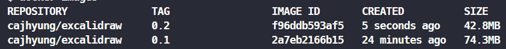
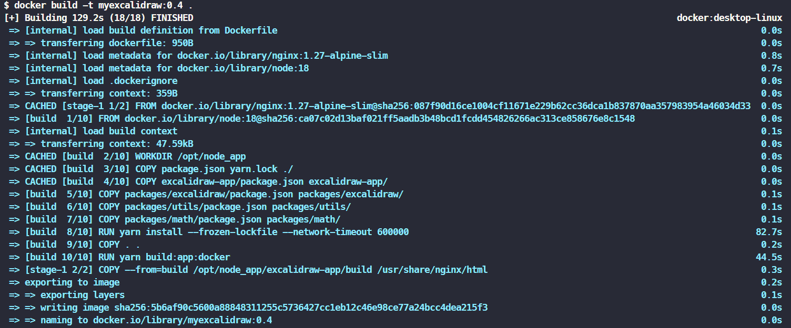
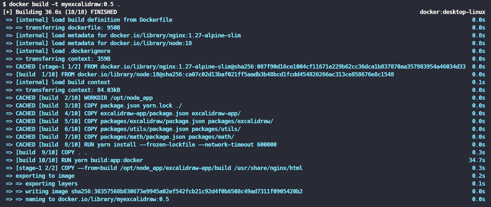

<a href="https://excalidraw.com/" target="_blank" rel="noopener">
  <picture>
    <source media="(prefers-color-scheme: dark)" alt="Excalidraw" srcset="https://excalidraw.nyc3.cdn.digitaloceanspaces.com/github/excalidraw_github_cover_2_dark.png" />
    
  </picture>
</a>

<h4 align="center">
  <a href="https://excalidraw.com">Excalidraw Editor</a> |
  <a href="https://blog.excalidraw.com">Blog</a> |
  <a href="https://docs.excalidraw.com">Documentation</a> |
  <a href="https://plus.excalidraw.com">Excalidraw+</a>
</h4>

<div align="center">
  <h2>
    An open source virtual hand-drawn style whiteboard. </br>
    Collaborative and end-to-end encrypted. </br>
  <br />
  </h2>
</div>

<br />
<p align="center">
  <a href="https://github.com/excalidraw/excalidraw/blob/master/LICENSE">
    
  </a>
  <a href="https://www.npmjs.com/package/@excalidraw/excalidraw">
    
  </a>
  <a href="https://docs.excalidraw.com/docs/introduction/contributing">
    
  </a>
  <a href="https://discord.gg/UexuTaE">
    
  </a>
  <a href="https://twitter.com/excalidraw">
    
  </a>
</p>

<div align="center">
  <figure>
    <a href="https://excalidraw.com" target="_blank" rel="noopener">
      
    </a>
    <figcaption>
      <p align="center">
        Create beautiful hand-drawn like diagrams, wireframes, or whatever you like.
      </p>
    </figcaption>
  </figure>
</div>

## 실행 명령어

```
docker build -t myexcalidraw:0.1 .
```

## Dockerfile 최적화 실습

- nginx 이미지 slim으로 변경.
- Dockerfile 캐시 레이어 최적화.

## 결과

### 이미지 크기 최적화

tag 0.1 -> nginx alpine 버전 사용

tag 0.2 -> nginx alpine slim 버전 사용

총 30MB 최적화



### 캐시 레이어 최적화

- 최적화 before: 기존 코드에서는 모든 파일 복사 후 빌드를 수행했기 때문에 코드 한 글자만 변경하여도 3번째 줄 부터 새로운 레이어가 생성되어 시간이 많이 소요되었습니다.

```
FROM node:18 AS build

WORKDIR /opt/node_app

COPY . .

# do not ignore optional dependencies:
# Error: Cannot find module @rollup/rollup-linux-x64-gnu
RUN yarn --network-timeout 600000

ARG NODE_ENV=production

RUN yarn build:app:docker

FROM nginx:1.27-alpine-slim

COPY --from=build /opt/node_app/excalidraw-app/build /usr/share/nginx/html

HEALTHCHECK CMD wget -q -O /dev/null http://localhost || exit 1
```



❗ 결과:129초

---


- 최적화 after: package.json, yarn.lock 파일들을 먼저 복사하고 설치한 후 나머지 코드를 복사하여 빌드를 수행하도록 Dockerfile을 변경했습니다.
- 코드 변경이 있을 때만 마지막 부분부터 새로운 레이어로 빌드가 수행됩니다.
- 현재 프로젝트는 모노레포 방식으로 구축되어 있기 때문에 각 프로젝트마다 package.json을 설치해야합니다.

```
# Stage 1: Build
FROM node:18 AS build

WORKDIR /opt/node_app

# Copy root package.json and yarn.lock
COPY package.json yarn.lock ./

# Copy workspace package.json files
COPY excalidraw-app/package.json excalidraw-app/
COPY packages/excalidraw/package.json packages/excalidraw/
COPY packages/utils/package.json packages/utils/
COPY packages/math/package.json packages/math/
# Add other workspaces as needed

# Install dependencies
RUN yarn install --frozen-lockfile --network-timeout 600000

# Copy the rest of the source code
COPY . .

# Set build environment variable
ARG NODE_ENV=production
ENV NODE_ENV=${NODE_ENV}

# Build the application
RUN yarn build:app:docker

# Stage 2: Production Image
FROM nginx:1.27-alpine-slim

# Copy built assets to Nginx
COPY --from=build /opt/node_app/excalidraw-app/build /usr/share/nginx/html

# Healthcheck
HEALTHCHECK CMD wget -q -O /dev/null http://localhost || exit 1

```





❗ 결과: 36초

---

